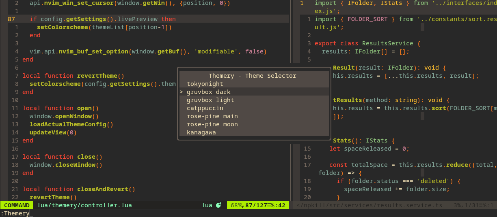

<p align="center">

</p>

Themery is a plugin for Neovim written in Lua which allows you to quickly switch between your installed themes through a menu and making them persistent like VSCode. Very convenient.

<p align="center">

</p>

- [Features](#features)
- [Motivation](#motivation)
- [Usage](#usage)
- [Installation](#installation)
  - [vim-plug](#vim-plug)
  - [Packer](#packer)
- [Configuration](#configuration)
  - [Setup](#setup)
    - [Minimal config](#minimal-config)
    - [Customizing names](#customizing-names)
    - [Executing code on theme apply](#executing-code-on-theme-apply)
- [API](#API)
  - [Example - Alternate between 2 themes](#Example---Alternate-between-2-themes)
- [License](#license)

## Features

- 🎨 **Theme Switching**: Quickly switch between your colorscheme.
- 💾 **Persistent**: Make your selected theme persistent across sessions, just like in VSCode.
- 🔍 **Live Preview**: See a live preview of the theme as you navigate through the list.
- 🛠️ **Custom Hooks**: Define code to be executed before and after applying a theme (define variables, for example).
- 🚀 **Optimized Performance**: Lightweight and optimized for fast performance.
- 🆓 **No Dependencies**: Because things are more fun when they don't depend on other stuff.

## Motivation

In most text editors there is usually an option to change the colorscheme quickly. This is very useful for adapting if you work in daylight or at night, if you have to make a presentation on a projector or simply because you like to change often.

In vim there is no "efficient" way to change them;

1. You can change it in the configuration file but that involves opening and editing it.
2. You can use `:colorscheme <theme>` but it is temporary and sometimes you need to run some more command to apply the theme to other plugins or set some variables.

Themery adds to your neovim a menu from which you can switch between all of them simply and quickly.

## Usage

Open with `:Themery` and navigate and move between the results with `j` and `k`.

Press `<cr>` for apply theme and save. `q` or `<Esc>` for exit without applying.

## Installation

Choose one of these options and continue with "Configuration".

### vim-plug

```
Plug 'zaldih/themery.nvim'
```

### Packer

```
use 'zaldih/themery.nvim'
```

## Configuration

Configuration is simple and intuitive.

#### Minimal config

Let's get down to the nitty-gritty first. Anywhere in your configuration put this:

```lua
-- Minimal config
require("themery").setup({
  themes = {"gruvbox", "ayu", ...}, -- Your list of installed colorschemes.
  livePreview = true, -- Apply theme while picking. Default to true.
})
```

Thats is all! When you open Themery you will see the above **themes** list.

#### Customizing names

Let's see how we can customise the list a bit...

```lua
-- Set custom name to the list
require("themery").setup({
  themes = {{
    name = "Day",
    colorscheme = "kanagawa-lotus",
  },
  {
    name = "Night",
    colorscheme = "kanagawa-dragon",
  }},
})
```

#### Executing code on theme apply

Let's go one step further.

Sometimes it is necessary to add additional instructions to make your favourite theme work.

Themery includes a before and after option that will be executed respectively before applying the theme.

For example, **gruvbox** uses a variable to switch between **light** and **dark** mode.

```lua
-- Using before and after.
require("themery").setup({
  themes = {{
    name = "Gruvbox dark",
    colorscheme = "gruvbox",
    before = [[
      -- All this block will be executed before apply "set colorscheme"
      vim.opt.background = "dark"
    ]],
  },
  {
    name = "Gruvbox light",
    colorscheme = "gruvbox",
    before = [[
      vim.opt.background = "light"
    ]],
    after = [[-- Same as before, but after if you need it]]
  }},
  [...]
})
```

That is, everything inside those variables will be executed as Lua code.

> [!IMPORTANT]  
> Note that all code in after and before must be declared as a string. That is, wrapped between '[[' and ']]' and not as a function.

## API

Themery exposes several functions that you can use to interact with themes programmatically.

- `getCurrentTheme()`: Return the current theme configured (a table with **index** (int) and **name** (string)), or nil.
- `setThemeByName(name:string, shouldSave:boolean)`: Set a theme based on the name specified. If shouldSave is true, the selection will be saved. _The name refers to the name chosen by the user in the configuration and not to the name of the colorscheme_.
- `setThemeByIndex(index:Int, shouldSave:boolean)`: Sets the colour scheme that occupies the index specified in the list of themes in the themery configuration, starting from 1. If shouldSave is true, the selection will be saved.

> [!NOTE]
> More will be added gradually, but if you have something in mind and need more control, feel free to open an issue!

### Example - Alternate between 2 themes

The following example illustrates how to use the above methods to switch between light and dark mode:

```lua
vim.keymap.set("n", "<leader>tt", function()
	local themery = require("themery")
	local currentTheme = themery.getCurrentTheme()
	if currentTheme and currentTheme.name == "gruvbox light" then
		themery.setThemeByName("gruvbox dark", true)
	else
		themery.setThemeByName("gruvbox light", true)
	end
end, { noremap = true })
```

## WIP

**Project under development.**
Many things can change at any time and the plugin may not be stable.

**Let me know if you have any suggestions, comments or bugs!**

In the future I would like the plugin to become a complete theme manager so that themes can be tested on the fly before installing them or browsing through a community repertoire.

## License

GPL
